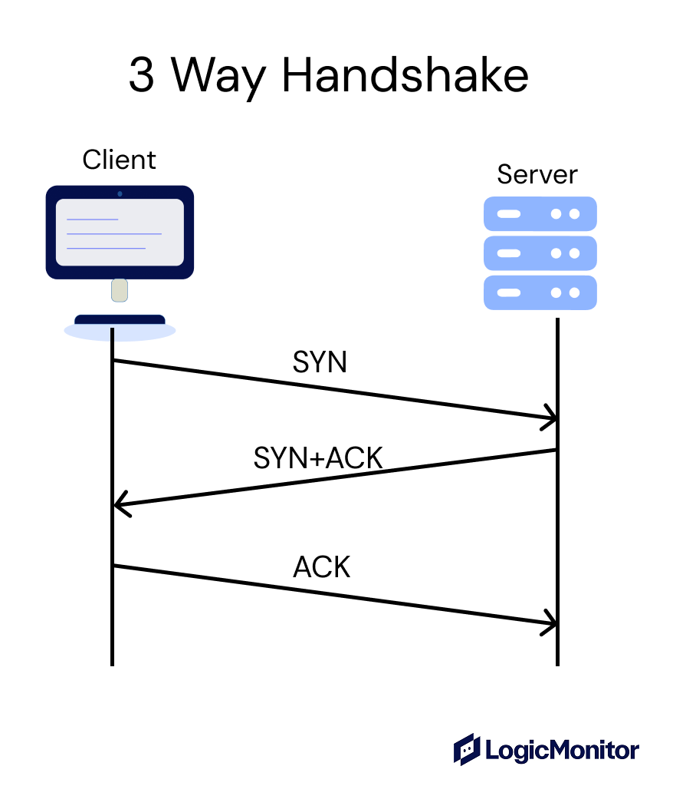
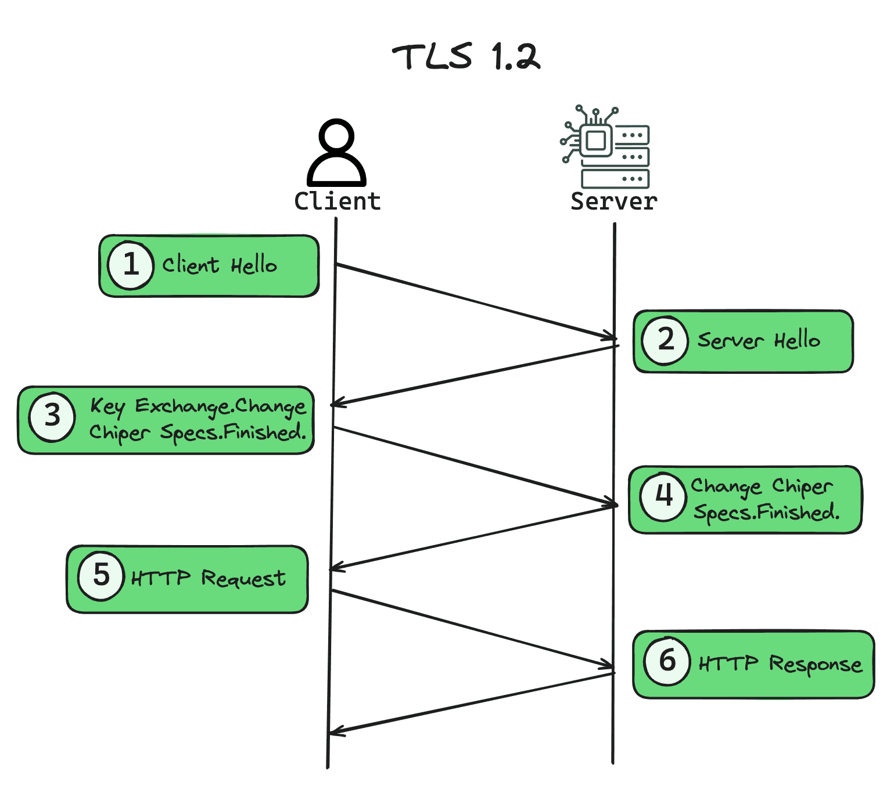
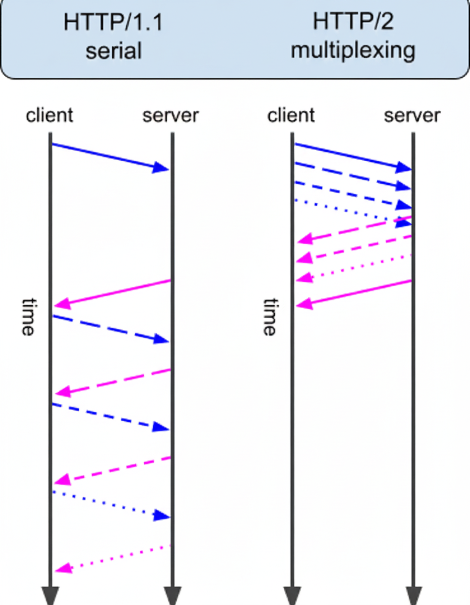

<!-- _class: lead -->
<!-- _paginate: false -->

# Intro a Redes para Devs Web

## O que todo programador web precisa saber sobre redes

**Vinicius Dias**

<!--
Boa tarde/noite a todos! Meu nome é Vinicius Dias e hoje vamos falar sobre redes de computadores, mas do ponto de vista de quem desenvolve para a web. A ideia não é formar administradores de rede, mas sim entender o que acontece por baixo dos panos quando nosso código PHP recebe uma requisição. Essa palestra é baseada no meu livro "Introdução a Redes para Desenvolvedores Web".
-->

---

# Quem sou eu

- **PHP Certified Engineer** pela Zend
- Pós-graduado em **Arquitetura de Software**
- Pós-graduando em **Computação Forense**
- **Tech Lead** na SOCi (EUA)
- YouTube: **Dias de Dev** (@DiasDeDev)
- Autor: *Introdução a Redes para Desenvolvedores Web*

<!--
Rapidamente sobre mim: sou certificado em PHP pela Zend, tenho pós em Arquitetura de Software e estou cursando Computação Forense. Trabalho como Tech Lead na SOCi, empresa americana. No YouTube tenho o canal Dias de Dev onde publico conteúdo técnico. E recentemente lancei o livro que deu origem a essa palestra.
-->

---

<!-- _class: lead -->

# Fundamentos de Rede

<!--
Vamos começar pelos fundamentos: pacotes, métricas, camadas e protocolos.
-->

---

# Pacotes

- Dados são quebrados em **pacotes** (ex: JSON de 200KB → dezenas de pacotes)
- Cada pacote: dados + metadados (origem, destino, identificação)
- Pacotes podem seguir **caminhos diferentes** e são remontados no destino

<!--
Quando enviamos dados pela rede, eles não vão de uma vez só. São quebrados em pacotes menores. Um JSON de 200KB chega em dezenas de pacotes independentes. Cada pacote carrega os dados em si mais metadados como origem e destino. E o mais interessante: cada pacote pode seguir um caminho diferente até o destino, onde tudo é remontado antes da aplicação receber a informação completa.
-->

---

# Métricas de Rede

<div style="display: flex; justify-content: center;">

| Métrica | O que é | Analogia |
|---------|---------|----------|
| **Latência** | Tempo de ida de uma mensagem | Gota d'água no cano |
| **Bandwidth** | Quantidade de dados por segundo | Diâmetro do cano |
| **RTT** | Ida + volta | Ping-pong |

</div>

<!--
As métricas principais que importam pra gente são: latência, que é o tempo que um pacote leva pra ir de um ponto a outro; bandwidth, que é a capacidade do canal, ou seja, quantos bytes por segundo trafegam; e RTT, que é o tempo de ida e volta. A analogia do cano funciona bem: latência é a velocidade da gota d'água percorrendo o cano, bandwidth é o diâmetro do cano. Ambas importam, e várias técnicas do dia a dia de dev web existem pra reduzir uma ou outra.
-->

---

# Camadas TCP/IP

```
┌─────────────────────────────┐
│    4. Aplicação             │  ← HTTP, DNS, SSH, FTP
├─────────────────────────────┤
│    3. Transporte            │  ← TCP, UDP
├─────────────────────────────┤
│    2. Internet              │  ← IP, ICMP
├─────────────────────────────┤
│    1. Acesso à Rede         │  ← Ethernet, Wi-Fi
└─────────────────────────────┘
```

- Cada camada resolve **um problema** e serve a camada acima
- Como dev web, trabalhamos nas camadas **3 e 4**

<!--
A comunicação em rede é organizada em camadas. O modelo TCP/IP, que é o mais prático, tem 4 camadas. A camada de acesso à rede cuida do meio físico, Ethernet, Wi-Fi. A camada de Internet cuida do endereçamento com IP. A de Transporte cuida da entrega confiável com TCP ou rápida com UDP. E a de Aplicação é onde moram HTTP, DNS, SSH. Como devs web, a gente vive nas camadas 3 e 4, mas entender as de baixo ajuda muito no debug.
-->

---

# Protocolos

- **Regras** que definem como a comunicação funciona
- Estrutura, formato, início, término, tratamento de erros
- Todo protocolo **opera em alguma das camadas**
- Cada camada possui seus próprios protocolos

<!--
Protocolos são conjuntos de regras. Eles definem o formato das mensagens, como iniciar e encerrar conexões, como lidar com erros. Nosso código PHP já interage com protocolos o tempo todo. Quando acessamos SERVER_PROTOCOL, estamos vendo qual versão do HTTP está sendo usada. O importante aqui é entender que cada camada tem seus próprios protocolos, e todo protocolo opera em alguma dessas camadas — vamos ver vários deles ao longo da palestra.
-->

---

<!-- _class: lead -->

# Camada de Internet

<!--
Vamos descer uma camada e falar de IP, roteamento e NAT.
-->

---

# IP - Internet Protocol

- Endereça dispositivos e roteia pacotes
- **Não garante**: entrega, ordem, integridade

<div style="display: flex; justify-content: center;">

| IPv4 | IPv6 |
|------|------|
| `142.250.219.142` | `2800:3f0:4004:815::200e` |
| 4 octetos (0-255) | 8 grupos hexadecimais |
| ~4 bilhões de endereços | 340 undecilhões |
| Ainda o mais usado | O futuro (já presente) |

</div>

```php
$ip = $_SERVER['REMOTE_ADDR'];
// "192.168.0.1" ou "::1" (localhost IPv6)
```

<!--
O protocolo IP cuida de endereçar dispositivos e rotear pacotes. Importante: ele NÃO garante que o pacote vai chegar, nem a ordem. Isso é problema de outra camada. Temos IPv4, que todo mundo conhece, com aqueles 4 números separados por ponto, e IPv6, que são 8 grupos hexadecimais. O IPv4 tem "só" 4 bilhões de endereços e já não é suficiente. O IPv6 tem um número absurdo. No PHP, quando acessamos REMOTE_ADDR, estamos pegando o IP do cliente.
-->

---

# Roteamento

A pergunta que todo dispositivo faz: **o destino está na minha rede ou em outra?**

- **Mesma rede** (ex: app + banco na mesma VPC): vai direto via **switch**
- **Rede diferente** (ex: app → API externa): sai pelo **gateway**, pula entre roteadores até chegar

> App e banco na **mesma rede** = menos saltos = menos latência

<!--
Vamos pensar nisso de forma prática como dev web. Imagina o cenário clássico: sua aplicação roda em um servidor e precisa acessar um banco de dados. Quando o servidor de aplicação manda um pacote pro banco, ele se faz uma pergunta: esse banco está na minha rede ou em outra? Se a aplicação e o banco estão na mesma rede privada, na mesma VPC por exemplo, o pacote vai direto, passando só por switches. Caminho curto, latência baixa. Agora se o banco está em outra rede, o pacote vai pro gateway padrão, que repete a mesma pergunta. Se não conhece o destino, encaminha pra outro roteador, e o pacote vai pulando até chegar no banco. Cada salto adiciona latência. É por isso que, em produção, a gente sempre tenta deixar a aplicação o mais perto possível do banco — mesma VPC, mesma região, mesma zona de disponibilidade. Cada roteador a menos no caminho é latência a menos por query. Em uma requisição que faz 20 queries, isso multiplica rápido. Pra debugar isso na prática a gente usa traceroute, que mostra cada hop entre origem e destino — útil quando você suspeita que latência alta vem da rede e não da aplicação ou do banco.
-->

---

# NAT - Network Address Translation

- IPs privados **não são roteáveis** na internet
- O roteador traduz IP privado → IP público

<div style="display: flex; justify-content: center;">

| IP Privado | Porta Origem | IP Público | Porta NAT |
|------------|-------------|------------|-----------|
| 192.168.0.10 | 45000 | 200.100.50.1 | 60001 |
| 192.168.0.11 | 38000 | 200.100.50.1 | 60002 |

</div>

- Por isso `$_SERVER['REMOTE_ADDR']` pode não identificar o usuário diretamente — vários clientes podem chegar pelo mesmo IP público
- Atrás de load balancer ou proxy? O `REMOTE_ADDR` é o do proxy. Use `X-Forwarded-For`

<!--
Os IPs privados como 192.168 não funcionam na internet. O roteador faz NAT: traduz o IP privado pra um IP público, usando uma tabela com portas pra saber pra quem devolver a resposta. Por isso que quando você pega o REMOTE_ADDR no PHP, ele é um IP real, mas pode não identificar o usuário individualmente: vários clientes saindo pela mesma rede chegam com o mesmo IP público. Se o PHP está atrás de um load balancer ou proxy reverso, o REMOTE_ADDR vai ser o IP do proxy. Aí precisa usar o header X-Forwarded-For. No Laravel tem a configuração de trusted proxies pra lidar com isso de forma segura.
-->

---

<!-- _class: lead -->

# Camada de Transporte

<!--
Agora vamos falar de TCP e UDP, que são os protocolos que cuidam de entregar os dados de forma confiável ou rápida.
-->

---

# Portas

- **Porta**: número que identifica um serviço no dispositivo (0-65535)
- Permitem **vários serviços** rodando no mesmo IP
- **Entrada**: o serviço escolhe a porta que vai "escutar"
- **Saída**: o SO atribui uma porta automaticamente para cada conexão

<!--
Portas são números que identificam um serviço específico rodando em um dispositivo. O range vai de 0 a 65535. A grande sacada é que elas permitem vários serviços coexistirem no mesmo IP — sem porta, o pacote chegaria no dispositivo certo mas a camada de transporte não saberia pra qual processo entregar. Tem uma diferença importante entre os dois sentidos: na entrada, o software escolhe em qual porta vai escutar conexões. Na saída, é o sistema operacional que atribui uma porta automaticamente pra cada conexão. Isso aparece direto na tabela do NAT que vimos antes. Os protocolos da camada de aplicação têm portas padrão, mas a gente vai falar deles no próximo bloco da palestra.
-->

---

# Sockets

**Socket** = ponto final de um fluxo de dados na rede

**Unix Socket** (local):
- Comunicação via **arquivo** → `/var/run/php/php-fpm.sock`
- Mais rápido que TCP (sem overhead de rede)

**IP Socket** (rede):
- Combinação de **IP + porta** → `127.0.0.1:9000`
- Comunicação entre máquinas (ou processos via rede)

> **Dica**: configure Nginx ↔ PHP-FPM via Unix Socket ao invés de `127.0.0.1:9000` pra melhor performance

<!--
Um socket é o ponto final de um fluxo de dados. Temos dois tipos: IP Sockets, que são a combinação de IP com porta usada pra comunicação em rede, e Unix Sockets, que usam um arquivo no sistema pra comunicação entre processos na mesma máquina. O Unix Socket é mais rápido porque não tem o overhead do protocolo TCP. É muito comum e recomendado configurar Nginx e PHP-FPM se comunicando via Unix Socket em vez de TCP na porta 9000. A diferença de performance é mensurável, especialmente sob alta carga.
-->

---

# TCP - Transmission Control Protocol

- **Orientado a conexão** (handshake antes de enviar dados)
- Garante **entrega** e **ordem**
- Retransmite pacotes perdidos automaticamente
- Protocolo de transporte mais utilizado no dia-a-dia da *web*

<!--
TCP é o protocolo de transporte mais usado na web. Ele é orientado a conexão, ou seja, antes de trocar dados, faz um handshake de 3 vias: SYN, SYN-ACK, ACK. É como uma ligação telefônica: primeiro você disca, a pessoa atende, e aí vocês falam. O TCP garante que os dados chegam, na ordem certa, e retransmite o que se perder. Todo o HTTP que a gente usa é baseado em TCP. Mas esse handshake tem um custo: no mínimo 1 RTT antes de enviar qualquer dado.
-->

---

# TCP: Three-Way Handshake

<div style="display: flex; justify-content: center; align-items: center;">



</div>

<!--
Esse é o diagrama do handshake de 3 vias. O cliente envia SYN, o servidor responde com SYN+ACK, e o cliente confirma com ACK. Só depois disso os dados começam a fluir. Isso significa que antes de qualquer byte de dados, já temos pelo menos 1 RTT de latência. Se somarmos o handshake TLS, são mais round-trips ainda. Por isso que protocolos como QUIC tentam reduzir esse custo.
-->

---

# A Regra dos 14KB

- Primeiro segmento TCP pode carregar **~14KB**
- Se sua página HTML cabe em 14KB → **1 round-trip**
- Se passa de 14KB → round-trips adicionais

> Uma página de 15KB em vez de 14KB pode custar **+612ms** em conexões lentas

- **Dica prática**: respostas críticas (HTML inicial) devem ser enxutas
- CSS/JS inline com cuidado, compressão ajuda!

<!--
Aqui tem um detalhe de performance que poucos devs conhecem. O TCP começa transmitindo com uma janela pequena, de cerca de 14KB. Se o HTML da sua página cabe em 14KB, ele chega no primeiro round-trip. Se passa um pouco, precisa de um round-trip adicional, e dependendo da latência isso pode significar mais de meio segundo. Por isso sites de alta performance otimizam pra que a resposta inicial caiba nesse limite. Compressão ajuda muito aqui.
-->

---

# UDP - User Datagram Protocol

- **Sem conexão** (sem handshake)
- **Não garante** entrega nem ordem
- Mais rápido e leve que TCP
- Usa datagramas ao invés de segmentos
- Ideal quando **velocidade importa mais que confiabilidade**

<!--
O UDP é o oposto do TCP. Não tem handshake, não garante entrega, não garante ordem. Mas é muito mais rápido e leve, justamente porque não tem toda a cerimônia de controle do TCP. É usado quando velocidade importa mais que confiabilidade — pra coisas onde perder um pacote eventual é tolerável, ou onde a aplicação prefere lidar com isso por conta própria do que pagar o custo de uma conexão TCP. Vamos ver protocolos de aplicação que usam UDP mais pra frente.
-->

---

# Prática: tcpdump + nc

Simulando uma conexão **na própria máquina** (interface `lo`):

```shell
# Terminal 1 — monitora o tráfego na porta 8000
$ sudo tcpdump -i lo port 8000

# Terminal 2 — escuta a porta (servidor)
$ nc -lv 8000          # TCP
$ nc -ulv 8000         # UDP

# Terminal 3 — conecta no servidor (cliente)
$ nc -v 127.0.0.1 8000     # TCP
$ nc -u 127.0.0.1 8000     # UDP
```

- **TCP**: 3 pacotes do handshake antes de qualquer dado + ACKs + 3 ao fechar
- **UDP**: só o pacote da mensagem. Nada antes, nada depois

<!--
Antes de comparar TCP e UDP numa tabela, vale ver isso funcionando ao vivo. A gente usa duas ferramentas que já vêm em qualquer Linux: o tcpdump pra monitorar o tráfego e o nc, ou netcat, pra abrir sockets de rede. Tudo na mesma máquina, usando a interface loopback. Abre três terminais: um com o tcpdump escutando a porta 8000, um com nc no modo listen pra fazer papel de servidor, e outro com nc abrindo conexão pra fazer papel de cliente. Quando você usa TCP, antes de qualquer mensagem aparecer no tcpdump você já vê 3 pacotes do handshake. Cada mensagem trocada gera o pacote da mensagem mais um ACK. Ao fechar com Ctrl+C, mais 3 pacotes pra encerrar. Agora se você troca pelas variantes com -u, que é UDP, o tcpdump mostra só o pacote da mensagem em si. Sem handshake, sem ACK, sem fechamento. É a forma mais clara de ver na prática a diferença entre os dois protocolos.
-->

---

# TCP vs UDP

<div style="display: flex; justify-content: center;">

| | TCP | UDP |
|---|---|---|
| Conexão | Handshake | Sem conexão |
| Entrega | Garantida e ordenada | Não garantida |
| Retransmissão | Automática | Não há |
| Velocidade | Mais lenta, confiável | Mais rápida |
| Uso típico | HTTP, banco, e-mail | DNS, jogos, streaming |

</div>

> Como escolher? Se **perder dados é inaceitável** → TCP.
> Se **velocidade importa mais** → UDP.

<!--
Essa tabela resume bem as diferenças. TCP é pra quando precisa de confiabilidade: HTTP, conexão com banco de dados, e-mail. UDP é pra quando velocidade importa mais que garantia: DNS, jogos online, streaming. Uma forma simples de decidir: se perder um pacote é inaceitável, use TCP. Se velocidade é prioridade e perda eventual é tolerável, use UDP. E lembrando: HTTP/3 usa QUIC que é baseado em UDP, mas o QUIC reimplementa garantias de entrega por conta própria.
-->

---

<!-- _class: lead -->

# Camada de Aplicação

<!--
Agora vamos subir pra camada de aplicação, onde vivem DNS, SSH e os protocolos que a gente usa diretamente.
-->

---

# DNS - Domain Name System

- Traduz **nomes** em **IPs** (a "agenda de contatos" da internet)
- Hierárquico: Root → TLD (.com, .br) → Autoritativo

```
Navegador: "Qual o IP de meusite.com.br?"
    ↓
Resolver local (cache?) → Root Server → .br → meusite.com.br
    ↓
Resposta: 200.100.50.1 (TTL: 3600s)
```

- **Porta 53** (UDP geralmente, TCP pra respostas grandes)
- "Propagação de DNS" é mito! É só **expiração de cache** (TTL)

<!--
DNS é o sistema que traduz nomes de domínio em IPs. Quando você digita um site no navegador, uma consulta DNS acontece antes de qualquer coisa. O sistema é hierárquico: root servers sabem quem cuida do .com, o .com sabe quem cuida do google.com, e assim por diante. Um detalhe importante: "propagação de DNS" não existe. O que acontece é que resolvers fazem cache das respostas pelo tempo do TTL. Quando você muda um DNS, é só esperar os caches expirarem. Por isso que ao migrar um domínio, é bom abaixar o TTL antes.
-->

---

# DNS na Prática PHP

**Tipos de registro:**

<div style="display: flex; justify-content: center;">

| Tipo | Função | Exemplo |
|------|--------|---------|
| **A** | IPv4 | `93.184.216.34` |
| **AAAA** | IPv6 | `2606:2800:220:1::` |
| **CNAME** | Alias | `www` → domínio raiz |
| **MX** | E-mail | Servidores de e-mail |
| **TXT** | Texto | SPF, DKIM, verificação |

</div>

```php
$records = dns_get_record('example.com', DNS_A);
// [['ip' => '93.184.216.34', 'ttl' => 3600, ...]]
```

<!--
O PHP tem funções nativas pra consultar DNS. A dns_get_record retorna os registros de um domínio. Os tipos mais importantes: A é o registro principal que mapeia pra IPv4, AAAA pra IPv6, CNAME é um alias (o famoso www apontando pro domínio raiz), MX é pra servidores de e-mail, e TXT é usado pra verificação de domínio, SPF, DKIM. Quando vocês configuram e-mail no domínio, estão mexendo com registros MX e TXT.
-->

---

# Outros protocolos da camada de aplicação

- **SSH** (22) — acesso remoto seguro a servidores; chaves pública/privada
- **FTP** (20/21) — transferência de arquivos (sem criptografia)
- **SFTP** (22) — FTP sobre SSH; criptografado
- **SMTP** (587) — envio de e-mails
- **POP3** (995) — recebimento; baixa e remove do servidor
- **IMAP** (993) — recebimento; mantém tudo sincronizado no servidor

<!--
Além de DNS e HTTP, que são os protocolos que mais nos interessam como devs web, a camada de aplicação tem outros que vale conhecer. SSH é como a maioria de nós acessa servidores remotos — usa criptografia de chave pública/privada e roda na porta 22. FTP é o protocolo clássico de transferência de arquivos, sem criptografia, lembra do deploy direto via FileZilla? Hoje em dia usamos SFTP, que é FTP sobre SSH, então a comunicação é criptografada. Pra e-mail temos três protocolos: SMTP pra envio, e POP3 ou IMAP pra recebimento. A diferença entre POP3 e IMAP é que o POP3 baixa as mensagens e tira do servidor, enquanto o IMAP mantém tudo sincronizado no servidor — por isso aplicações modernas usam IMAP. Em PHP, pra mexer com e-mail a gente normalmente usa PHPMailer ou Symfony Mailer.
-->

---

<!-- _class: lead -->

# HTTP a Fundo

### Nosso principal protocolo como devs web

<!--
Agora vamos pro coração da palestra: HTTP. É o protocolo que a gente mais usa e precisa entender bem.
-->

---

# HTTP: O Protocolo da Web

- **H**yper**T**ext **T**ransfer **P**rotocol
- Funciona sobre **TCP** (até a HTTP/2)
- Modelo **request/response** (cliente pede, servidor responde)
- Baseado em **texto** (até HTTP/1.1)
- **Stateless** - cada requisição é independente

<!--
HTTP significa Hypertext Transfer Protocol. É o protocolo que transfere hipertexto, ou seja, texto com links. Funciona no modelo request-response: o cliente faz uma requisição, o servidor responde. Até a versão 1.1, tudo era texto puro, dava até pra ler com os olhos. E é stateless: cada requisição é independente, o servidor não "lembra" da anterior. Por isso existem cookies e sessões. O HTTP funciona sobre TCP nas versões 1.1 e 2, e sobre QUIC/UDP na versão 3.
-->

---

# Anatomia de uma Requisição

```http
POST /api/users HTTP/1.1
Host: meusite.com.br
Content-Type: application/json
Authorization: Bearer eyJhbGciOiJIUz...
Accept: application/json
User-Agent: Mozilla/5.0

{"name": "João", "email": "joao@email.com"}
```

**3 partes:**
1. **Linha de requisição**: Método + Caminho + Versão
2. **Cabeçalhos**: Metadados (chave: valor)
3. **Corpo**: Dados (opcional)

<!--
Uma requisição HTTP tem 3 partes. A primeira linha traz o método (POST nesse caso), o caminho (/api/users), e a versão do protocolo. Depois vêm os cabeçalhos, que são metadados no formato chave-valor. E por fim o corpo, que é opcional e carrega os dados. No PHP, o método vem em $_SERVER['REQUEST_METHOD'], o corpo pode ser lido com file_get_contents('php://input') ou json_decode, e os headers podem ser acessados pela superglobal $_SERVER com prefixo HTTP_.
-->

---

# Anatomia de uma Resposta

```http
HTTP/1.1 200 OK
Content-Type: application/json; charset=utf-8
Cache-Control: no-cache
Set-Cookie: PHPSESSID=abc123; Path=/; HttpOnly; Secure

{"id": 1, "name": "João", "email": "joao@email.com"}
```

**3 partes:**
1. **Linha de status**: Versão + Código + Razão
2. **Cabeçalhos**: Metadados da resposta
3. **Corpo**: Conteúdo retornado

<!--
A resposta segue a mesma estrutura. A primeira linha traz a versão, o código de status (200 aqui), e uma frase descritiva. Depois os headers de resposta, incluindo Content-Type, configurações de cache, cookies. E por fim o corpo com o conteúdo. Reparem no PHPSESSID no Set-Cookie: é o identificador de sessão do PHP. Quando chamamos session_start(), o PHP automaticamente envia esse cookie.
-->

---

# URL — Uniform Resource Locator

Como **identificamos** um recurso na web:

```
protocolo://endereco:porta/caminho?parametros#secao
   https://  api.site.com  /posts/42  ?lang=pt    #top
```

- **Protocolo**: como acessar (`http`, `https`, `ssh`...)
- **Endereço**: qual servidor (domínio ou IP)
- **Porta**: opcional, padrão depende do protocolo
- **Caminho**: qual recurso no servidor
- **Query**: parâmetros de busca (`?id=1&lang=pt`)
- **Fragment**: **não vai pro servidor** — usado pelo navegador

<!--
Antes de falar dos métodos do HTTP, vale dar um passo atrás e pensar em como a gente identifica um recurso na web. Pra isso existe a URL, Uniform Resource Locator. Ela tem um formato bem definido, com várias partes. O protocolo no início diz como acessar — http, https, ssh, ftp. O endereço é o servidor, geralmente um domínio que vai ser resolvido via DNS. A porta é opcional, cada protocolo tem a sua padrão. O caminho identifica o recurso específico dentro do servidor. A query, depois do ponto de interrogação, são os parâmetros de busca, muito usados em GETs. E tem um detalhe que muita gente não sabe: o fragment, que é a parte depois do hashtag, não vai pro servidor. Ele fica só no navegador, geralmente pra rolar a página até uma seção. Você pode até observar isso no Network do DevTools: a URL completa fica no browser, mas a requisição só tem do path em diante. E uma curiosidade: você já deve ter visto o termo URI também. Toda URL é uma URI, mas nem toda URI é uma URL. Pra dev web no dia a dia, é URL mesmo.
-->

---

# Métodos HTTP

<div style="display: flex; justify-content: center;">

| Método | Uso | Safe | Idempotente | Cacheável |
|--------|-----|:---:|:---:|:---:|
| **GET** | Buscar recurso | Sim | Sim | Sim |
| **POST** | Criar recurso | Não | Não | Condicional |
| **PUT** | Substituir recurso | Não | Sim | Não |
| **PATCH** | Atualização parcial | Não | Não* | Condicional |
| **DELETE** | Remover recurso | Não | Sim | Não |
| **OPTIONS** | Verificar opções (CORS!) | Sim | Sim | Não |

</div>

<small>* `PATCH` não é idempotente por definição, mas implementações específicas podem ser.</small>

<!--
Os métodos HTTP definem a intenção da requisição. GET pra buscar, POST pra criar, PUT pra substituir completamente, PATCH pra atualizar parcialmente, DELETE pra remover. O OPTIONS é usado pelo CORS pra verificar permissões, vamos falar disso já já. Cada método se enquadra ou não em três categorias: seguro, idempotente e cacheável. Seguro, ou safe, é aquele método que é essencialmente read-only — o cliente não pede mudança de estado. GET, HEAD e OPTIONS são safe. Idempotente é quando uma requisição feita uma vez ou várias vezes produz o mesmo efeito no servidor. Todo método safe é idempotente, e além deles PUT e DELETE também são. Cacheável diz se um mecanismo de cache pode armazenar a resposta. GET e HEAD são cacheáveis por padrão. POST e PATCH são "condicionais" — só são cacheáveis se a resposta vier com headers específicos de freshness e Content-Location. Sobre o asterisco no PATCH: por definição da RFC, PATCH não é idempotente, igual o POST. Mas, na prática, dependendo de como a aplicação implementa, ele pode ser. Isso não torna o método idempotente, só aquela implementação dele.
-->

---

# Status Codes

<div style="display: flex; justify-content: center;">

| Faixa | Significado | Exemplos comuns |
|-------|-------------|----------------|
| **1xx** | Informacional | `100 Continue` |
| **2xx** | Sucesso | `200 OK`, `201 Created`, `204 No Content` |
| **3xx** | Redirecionamento | `301 Moved`, `302 Found`, `304 Not Modified` |
| **4xx** | Erro do cliente | `401 Unauthorized`, `403 Forbidden`, `404 Not Found`, `422 Unprocessable` |
| **5xx** | Erro do servidor | `500 Internal`, `502 Bad Gateway`, `503 Unavailable` |

</div>

- **502**: Nginx não consegue falar com PHP-FPM (quem nunca?)
- **422**: Validação falhou (Laravel usa bastante)

<!--
Os status codes são agrupados por centena. 2xx é sucesso, 3xx redirecionamento, 4xx erro do cliente, 5xx erro do servidor. Alguns são essenciais: 200 OK, 201 Created pra POST, 204 No Content pra DELETE sem corpo. O 301 é redirect permanente, 302 temporário. O 304 Not Modified é usado com cache. Nos erros, 401 é não autenticado, 403 é não autorizado, 404 não encontrado, e o 422 é muito usado no Laravel pra erros de validação. O temido 502 Bad Gateway geralmente significa que o Nginx não conseguiu se conectar ao PHP-FPM.
-->

---

# Cabeçalhos Importantes

**Requisição:**
- `Content-Type: application/json` — formato do corpo
- `Authorization: Bearer <token>` — autenticação
- `Accept: application/json` — formato desejado
- `X-Forwarded-For: 189.1.2.3` — IP real atrás de proxy

**Resposta:**
- `Content-Type` — formato da resposta
- `Cache-Control` — regras de cache
- `Set-Cookie` — definir cookies
- `Location` — destino do redirect

<!--
Os cabeçalhos carregam metadados essenciais. Na requisição, Content-Type diz o formato do corpo, Authorization carrega o token, Accept diz o que o cliente aceita receber. O X-Forwarded-For é crucial quando temos proxy reverso: ele carrega o IP original do cliente. Na resposta, Content-Type diz o formato, Cache-Control define as regras de cache, Set-Cookie define cookies no navegador, e Location indica pra onde redirecionar nos códigos 3xx.
-->

---

# Cache HTTP

```
Cache-Control: max-age=3600          → Cache por 1 hora
Cache-Control: no-cache              → Validar antes de usar
Cache-Control: no-store              → Nunca cachear
```

**Validação condicional:**
```
Servidor: ETag: "abc123"
Cliente:  If-None-Match: "abc123"
Servidor: 304 Not Modified  ← Sem corpo! Economia de banda
```

```
Servidor: Last-Modified: Wed, 21 Oct 2025
Cliente:  If-Modified-Since: Wed, 21 Oct 2025
Servidor: 304 Not Modified
```

<!--
Cache HTTP é uma das ferramentas mais poderosas pra performance. O Cache-Control define as regras: max-age diz por quanto tempo cachear, no-cache diz pra validar antes de usar, no-store proíbe cache. A validação condicional é elegante: o servidor envia um ETag (tipo um hash do conteúdo) e na próxima requisição o cliente manda esse ETag. Se o conteúdo não mudou, o servidor responde 304 sem corpo, economizando banda. O mesmo funciona com Last-Modified e If-Modified-Since.
-->

---

# Segurança HTTP

**Headers de segurança importantes:**

- **HSTS** (`Strict-Transport-Security`)
  - Força HTTPS, previne downgrade attacks
- **CSP** (`Content-Security-Policy`)
  - Controla de onde scripts/estilos podem carregar (mitiga XSS)
- **CORS** (`Access-Control-Allow-Origin`)
  - Controla quem pode acessar sua API de outro domínio

```php
// Exemplo básico de headers de segurança
header('Strict-Transport-Security: max-age=31536000');
header("Content-Security-Policy: default-src 'self'");
```

<!--
Existem headers HTTP que são fundamentais pra segurança. O HSTS diz pro navegador que o site só pode ser acessado via HTTPS, evitando ataques de downgrade. O CSP controla de quais origens scripts e estilos podem ser carregados, mitigando XSS. E o CORS controla quais domínios podem fazer requisições pra sua API a partir do navegador. Esses três headers devem estar configurados em toda aplicação web séria.
-->

---

# CORS na Prática

**Requisição simples** (GET, HEAD, POST com form):
```
Origin: https://meu-frontend.com
→ Access-Control-Allow-Origin: https://meu-frontend.com
```

**Requisição complexa** (JSON, PUT, DELETE, headers custom):
```
1. OPTIONS /api/users  ← Preflight
   Origin: https://meu-frontend.com
   Access-Control-Request-Method: DELETE

2. Access-Control-Allow-Origin: https://meu-frontend.com
   Access-Control-Allow-Methods: GET, POST, DELETE

3. DELETE /api/users/1  ← Requisição real
```

<!--
CORS é o terror de quem trabalha com frontend separado do backend. Existem dois tipos de requisição: simples e complexa. As simples, como GET e POST com formulário, só precisam que o servidor responda com o header Allow-Origin. As complexas, que usam JSON, métodos como PUT e DELETE, ou headers customizados, disparam um preflight: o navegador manda um OPTIONS antes da requisição real pra verificar se o servidor permite. No Laravel, o CORS é configurado no arquivo config/cors.php. Se vocês já viram aquele erro de CORS no console, provavelmente é o preflight sendo rejeitado.
-->

---

# Cookies e Sessões

```http
Set-Cookie: PHPSESSID=abc123; Path=/; Max-Age=7200;
            Secure; HttpOnly; SameSite=Lax
```

<div style="display: flex; justify-content: center;">

| Diretiva | Proteção |
|----------|----------|
| **Secure** | Só envia via HTTPS |
| **HttpOnly** | JavaScript não acessa (mitiga XSS) |
| **SameSite=Lax** | Proteção contra CSRF |
| **Max-Age** | Tempo de vida |

</div>

```php
session_start(); // Envia Set-Cookie: PHPSESSID=...
$_SESSION['user_id'] = 42;
$_COOKIE['PHPSESSID']; // "abc123"
```

<!--
Cookies são o mecanismo do HTTP pra manter estado entre requisições stateless. O servidor envia Set-Cookie na resposta, e o navegador envia esse cookie em toda requisição seguinte. O PHPSESSID é o cookie de sessão do PHP. As diretivas de segurança são essenciais: Secure garante que o cookie só é enviado via HTTPS, HttpOnly impede acesso via JavaScript (proteção contra XSS), e SameSite protege contra CSRF. No PHP, session_start() cuida de tudo isso automaticamente, mas vale configurar as diretivas no php.ini ou na chamada.
-->

---

<!-- _class: lead -->

# Além do HTTP

### Compressão, HTTPS, HTTP/2, HTTP/3 e mais

<!--
Agora vamos ver as evoluções do HTTP e tecnologias complementares.
-->

---

# Compressão

```
Cliente:  Accept-Encoding: gzip, deflate, br
Servidor: Content-Encoding: br

Corpo comprimido (muito menor!)
```

<div style="display: flex; justify-content: center;">

| Algoritmo | Suporte | Compressão |
|-----------|---------|-----------|
| **gzip** | Universal | Boa |
| **Brotli** (br) | Moderno | Melhor |
| **Zstandard** (zstd) | Emergente | Excelente |

</div>

- Nginx/Apache comprimem automaticamente (configure!)
- Lembra dos 14KB? Compressão ajuda a ficar dentro do limite

<!--
Compressão reduz drasticamente o tamanho das respostas HTTP. O cliente envia Accept-Encoding dizendo quais algoritmos suporta, e o servidor comprime com o melhor disponível. Gzip é o mais universal, Brotli tem compressão melhor e é suportado por todos os navegadores modernos. Configure no Nginx ou Apache pra comprimir automaticamente. E lembram da regra dos 14KB? Se seu HTML tem 20KB mas comprimido fica com 12KB, ele cabe no primeiro segmento TCP!
-->

---

# HTTPS e TLS

- **HTTPS** = HTTP + **TLS** (camada de criptografia)
- Protege contra **man-in-the-middle**
- **Assimétrica** → troca de chaves (lenta, segura)
- **Simétrica** → comunicação (rápida)
- **Let's Encrypt** → certificado grátis e automático

<!--
HTTPS é HTTP com TLS, que cria um canal criptografado. O handshake TLS usa criptografia assimétrica pra trocar uma chave de sessão, e depois usa criptografia simétrica (mais rápida) pra toda a comunicação. O certificado digital garante que o servidor é quem diz ser. Com Let's Encrypt, hoje não tem desculpa pra não usar HTTPS: é grátis e automático. O TLS 1.3 reduziu o handshake de 2 RTTs pra 1, melhorando a performance.
-->

---

# TLS: as 2 etapas do handshake

Após o handshake TCP, **outro handshake acontece**:

### 1. Verificação do certificado
- Cliente e servidor negociam versão do TLS e algoritmos
- Servidor envia o **certificado digital** (com sua chave pública)
- Cliente valida o certificado contra uma autoridade certificadora

### 2. Troca de chaves (*key exchange*)
- Cliente usa a **chave pública** para enviar ao servidor uma nova **chave de sessão**
- A partir daqui: **criptografia simétrica** (mais rápida) usando essa chave

> Assimétrica → troca; Simétrica → comunicação

<!--
Antes de ver o diagrama, vale fixar as duas etapas que existem em qualquer handshake TLS. Lembrando: isso acontece DEPOIS do handshake TCP. Primeira etapa: verificação do certificado. O cliente e o servidor negociam qual versão do TLS vão usar e qual algoritmo de criptografia. O servidor envia seu certificado digital, que contém a chave pública dele. O cliente valida esse certificado contra uma autoridade certificadora confiável — é isso que impede um atacante no meio do caminho de se passar pelo servidor. Segunda etapa: troca de chaves. Com a chave pública em mãos, o cliente gera uma chave de sessão, criptografa com a chave pública do servidor e envia. Só o servidor consegue decifrar. A partir daí os dois lados têm a mesma chave simétrica e toda a comunicação passa a usar criptografia simétrica, que é muito mais rápida. Resumindo: criptografia assimétrica é usada APENAS pra trocar a chave de sessão; a comunicação real usa simétrica.
-->

---

# Certificado Digital

Contém:

- A **chave pública** do servidor
- Para quem foi emitido (domínio)
- Quem emitiu (autoridade certificadora)
- Validade

**Quem assina?** As **CAs** (*Certificate Authorities*)

- O cliente não confia no servidor — confia nas **CAs**
- SO/navegador já vem com **certificados raiz** instalados
- **Let's Encrypt**: CA gratuita e automática (sem desculpa pra não usar HTTPS)

<!--
O certificado digital é o que impede um atacante no meio do caminho de se passar pelo servidor. A analogia que eu gosto é a do passaporte: você não pode emitir o seu próprio passaporte, você precisa de uma autoridade que faça isso, e quem confia nele confia na autoridade que emitiu. Com certificado é igual. O certificado contém a chave pública, pra quem foi emitido, ou seja, qual domínio, quem emitiu e a validade. Quem assina certificados são as autoridades certificadoras, as CAs. O ponto importante: o cliente não confia diretamente no servidor — ele confia em um conjunto de CAs raiz que já vem instalado no sistema operacional ou no navegador. Quando você acessa um site HTTPS, o navegador pega o certificado, vê quem assinou e checa se essa autoridade está na lista de confiáveis. Por isso um atacante não consegue simplesmente entregar uma chave pública falsa, porque ele não tem como gerar um certificado assinado por uma CA confiável. E uma boa notícia: hoje em dia tem o Let's Encrypt, que é uma CA gratuita e automatizada. Não tem mais desculpa pra rodar site sem HTTPS.
-->

---

# Vendo um certificado raiz (Linux)

```shell
# Listar certificados raiz da Let's Encrypt (ISRG)
$ ls /etc/ssl/certs | grep -i ISRG
ISRG_Root_X1.pem
ISRG_Root_X2.pem

# Ver o conteúdo de um certificado
$ openssl x509 -in /etc/ssl/certs/ISRG_Root_X1.pem -text -noout
```

A saída traz: emissor, titular, validade, algoritmo, **chave pública** e a assinatura

> Esses são os certificados que seu sistema **já confia por padrão**

<!--
Pra fechar a parte de certificados, vale ver na prática como olhar pra um certificado raiz no seu sistema. Em Linux, os certificados raiz que o SO confia ficam em /etc/ssl/certs. Você pode listar com ls e filtrar pela autoridade — aqui filtrei por ISRG, que é a Internet Security Research Group, organização por trás do Let's Encrypt. Pra ver o conteúdo do certificado, usa o openssl x509 com -text e -noout. A saída vai mostrar quem é o emissor, pra quem foi emitido, validade, algoritmo de criptografia, a chave pública em si e a assinatura. O ponto importante é que esses são exatamente os certificados em quem seu sistema confia por padrão, sem perguntar nada. Quando o navegador valida um certificado de site, ele tá checando se a cadeia de assinaturas chega em algum desses arquivos aqui.
-->

---

# TLS Handshake

<div style="display: flex; justify-content: center; align-items: center;">



</div>

<!--
Esse é o handshake TLS simplificado. O cliente envia um Client Hello com as versões e algoritmos que suporta. O servidor responde com Server Hello, escolhendo o algoritmo, e envia seu certificado digital. O cliente gera uma chave de sessão, cifra com a chave pública do certificado, e envia. A partir daí, ambos têm a mesma chave simétrica e toda comunicação é criptografada. No TLS 1.3, esse processo é mais rápido: o handshake acontece em 1 RTT em vez de 2.
-->

---

# Versões do HTTP

---

# HTTP/2

- **Binário** em vez de texto (mais eficiente)
- **Multiplexing**: múltiplas requisições na mesma conexão
- **HPACK**: compressão de cabeçalhos
- Acabou a era do domain sharding e sprite sheets!
- Exige HTTPS na prática (todos os browsers exigem)

<!--
HTTP/2 foi uma grande evolução. Em vez de texto, usa formato binário. A principal feature é multiplexing: múltiplas requisições e respostas trafegam na mesma conexão TCP simultaneamente. No HTTP/1.1, era uma fila: pede, espera resposta, pede o próximo. No HTTP/2, você manda tudo de uma vez e as respostas chegam conforme ficam prontas. Isso acabou com workarounds como domain sharding (usar vários domínios pra paralelizar conexões) e sprite sheets. Os cabeçalhos agora são comprimidos com HPACK: headers repetidos não são reenviados.
-->

---

# Multiplexing

<div style="display: flex; justify-content: center; align-items: center;">



</div>

---

# HTTP/3

- Troca TCP por **QUIC** (baseado em **UDP**)
- WiFi → 4G sem perder a conexão!
- TLS **embutido** no QUIC (sempre criptografado)
- Já suportado por CDNs (Cloudflare, etc.)

<!--
HTTP/3 é a mudança mais radical: troca TCP por QUIC, que é baseado em UDP. Isso resolve o problema do head-of-line blocking do HTTP/2: se um pacote se perde no TCP, TODOS os streams param. No QUIC, só o stream afetado para. O handshake também é mais rápido porque QUIC já inclui TLS, então são menos round-trips pra estabelecer a conexão. E tem Connection IDs: se você troca de WiFi pra 4G, a conexão não morre porque o identificador não é baseado em IP+porta. Cloudflare e outros CDNs já suportam HTTP/3.
-->

---

# HTTP/3

<div style="display: flex; justify-content: center;">

| Característica | HTTP/2 (TCP) | HTTP/3 (QUIC) |
|---|---|---|
| Perda de pacote | Bloqueia **tudo** | Bloqueia só **aquele stream** |
| Handshake | TCP + TLS separados | **Combinados** (menos RTT) |
| Troca de rede | Conexão morre | **Connection ID** mantém |

</div>

---

# WebSockets

- Comunicação **bidirecional** em tempo real
- Inicia via HTTP upgrade, depois vira conexão persistente
- Casos de uso: chat, jogos, editores colaborativos
- **Laravel Reverb**: WebSocket server nativo do Laravel

```javascript
const ws = new WebSocket('wss://meusite.com/chat');
ws.onmessage = e => console.log(e.data);
ws.send('Olá!');
```

<!--
HTTP é request-response, mas às vezes precisamos de comunicação em tempo real. WebSocket é bidirecional: tanto cliente quanto servidor enviam mensagens a qualquer momento. A conexão inicia como HTTP normal e faz upgrade pro protocolo WebSocket. Ideal pra chat, jogos, editores colaborativos. O Laravel Reverb é o servidor WebSocket oficial do Laravel, facilitando muito a implementação. Antes do Reverb, precisávamos de soluções como Ratchet ou Swoole.
-->

---

# Server-Sent Events (SSE)

- Comunicação **unidirecional**: servidor → cliente
- Usa HTTP normal (sem upgrade de protocolo)
- Navegador **reconecta automaticamente**
- Casos de uso: notificações, dashboards, feeds de preços

```php
header('Content-Type: text/event-stream');
header('Cache-Control: no-cache');

echo "event: nova_venda\n";
echo "data: {\"valor\": 150.00}\n\n";
flush();
```

<!--
SSE é a alternativa mais simples ao WebSocket quando você só precisa de comunicação do servidor pro cliente. Usa HTTP normal, não precisa de upgrade de protocolo, e o navegador reconecta automaticamente se a conexão cair. Em PHP é super simples de implementar: basta definir o Content-Type como text/event-stream e ir dando echo com flush. Ideal pra dashboards de vendas, notificações em tempo real, feeds de preço. Se não precisa de comunicação bidirecional, SSE é mais simples que WebSocket.
-->

---

# CDNs

- Rede global de servidores que **cacheia conteúdo**
- Serve do servidor **mais próximo** do usuário

```
Sem CDN:
  SP → Nova York (7700km, ~50ms RTT) × N round-trips

Com CDN:
  SP → São Paulo CDN (~5ms RTT) × N round-trips
```

- **Cache** de assets estáticos (CSS, JS, imagens)
- **Proteção DDoS** e **WAF**
- **Anycast**: mesmo IP, vários servidores no mundo
- Cloudflare, AWS CloudFront, Fastly...

<!--
CDNs são redes de servidores distribuídos pelo mundo que cacheiam seu conteúdo. Em vez do usuário de São Paulo acessar seu servidor em Nova York a 7700km de distância, ele acessa um servidor CDN em São Paulo. A diferença de latência é enorme. CDNs cacheiam assets estáticos, mas muitas também cacheiam respostas dinâmicas. Além de performance, oferecem proteção contra DDoS e WAF. Usam Anycast: o mesmo endereço IP é anunciado em vários pontos do mundo, e o BGP roteia pro mais próximo.
-->

---

<!-- _class: lead -->

# A Jornada Completa

### Do navegador ao PHP-FPM

<!--
Vamos juntar tudo e ver o caminho completo de uma requisição.
-->

---

# Jornada de uma Requisição

```
1. Navegador     → Resolve DNS (UDP/53)
2. DNS           → Retorna IP (pode ser CDN/Anycast)
3. Navegador     → TCP Handshake (SYN, SYN+ACK, ACK)
4. TCP           → TLS Handshake (certificado, chave)
5. TLS           → Requisição HTTP (GET /api/users)
6. CDN/LB        → Encaminha pro servidor de origem
7. Nginx         → Recebe, despacha pra PHP-FPM (porta 9000 ou socket)
8. PHP-FPM       → Executa o script PHP
9. PHP           → $_GET, $_POST, $_SERVER prontos!
10. Resposta     → Volta por todo o caminho (comprimida!)
```

<!--
Vamos juntar tudo. Quando alguém acessa sua aplicação: primeiro o navegador resolve o DNS via UDP. Com o IP em mãos, faz o handshake TCP de 3 vias. Depois o handshake TLS pra estabelecer criptografia. Aí sim envia a requisição HTTP. Se tem CDN, ela pode responder direto do cache. Se não, encaminha pro servidor de origem. O Nginx recebe e despacha pro PHP-FPM via FastCGI, na porta 9000 ou Unix Socket. O PHP-FPM executa o script, e nesse momento as superglobais estão prontas: $_GET, $_POST, $_SERVER, $_COOKIE. A resposta volta por todo esse caminho, comprimida, cacheada onde possível.
-->

---

# Referências — Livro e links

📘 **Livro**: [*Introdução a Redes para Desenvolvedores Web*](https://leanpub.com/redes-dev-web/)

✍️ **Posts no blog [dias.dev](https://dias.dev)**:
- [Cookies e segurança](https://dias.dev/2022-09-27-cookies-e-seguranca/)
- [Requisições HTTP paralelas com PHP](https://dias.dev/2021-03-13-requisicoes-http-paralelas-com-php/)

🔗 [Por que seu site deveria ter menos de 14kB](https://endtimes.dev/why-your-website-should-be-under-14kb-in-size/)

<!--
Antes de encerrar, deixo aqui as referências pra quem quiser se aprofundar. Primeiro o livro, que está no Leanpub. No blog tem posts complementares sobre cookies e segurança e sobre como fazer várias requisições HTTP em paralelo com PHP. E pra quem ficou curioso sobre a história dos 14kB, esse último link é o artigo original em inglês.
-->

---

# Referências — Vídeos no canal [@DiasDeDev](https://youtube.com/@DiasDeDev)

- [Como funciona a Web? — a internet por baixo dos panos](https://www.youtube.com/watch?v=B2IWlnJ_dt0)
- [Sockets de rede — como funciona a comunicação na Web](https://www.youtube.com/watch?v=qel4jIrh7Z0)
- [Firewalls — o mínimo que todo dev deve saber](https://www.youtube.com/watch?v=w-wKctaMGpU)
- [O que é CORS — resolvendo o erro `Access-Control-Allow-Origin`](https://www.youtube.com/watch?v=Fha6Il-5RYE)
- [Clickjacking — conhecendo e evitando esse ataque (CSP)](https://www.youtube.com/watch?v=xUgCMMVZ2_A)
- [Como usar Cache HTTP — performance na Web](https://www.youtube.com/watch?v=IrwIYywpvbM)
- [CDN: o que é e por que você PRECISA de uma](https://www.youtube.com/watch?v=2geXZqSeulA)
- [Swoole PHP: criando um servidor de WebSocket](https://www.youtube.com/watch?v=GCECSLtT49U)

<!--
E no canal do YouTube tenho vídeos cobrindo praticamente cada um dos tópicos que vimos hoje: fundamentos da web, sockets, firewalls, CORS, clickjacking com CSP, cache HTTP, CDN e WebSocket com Swoole.
-->

---

<!-- _class: lead -->

# Perguntas?

<!--
Chegamos ao fim! Vou mostrar o livro e abrir pra perguntas.
-->
